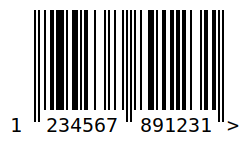

# barcode-svg

A Node.js utility program for generating an SVG barcode. Uses [JsBarcode](https://github.com/lindell/JsBarcode).

## Installation

Clone or download and unzip, then in the directory run:

```bash
yarn
```

Or with npm:

```bash
npm install
```

## Usage

Add an `.env.local` file with:

```bash
FORMAT="ean13"
CODE="123456789123"
# Optional
SUFFIX=">"
PATH="<destination-path>"
```

*The default destination directory is the project root and the filename is a combination of the code and format.*

Then run:

```bash
yarn start
```

Alternatively, you can use the following in bash:

```bash
FORMAT="ean13"; CODE="123456789123"; yarn start
```

A similar method can be used for other CLIs.

### Result:



### Note:

1. If the code is invalid for the format specified, an error will be shown.
2. You can omit the checksum.
